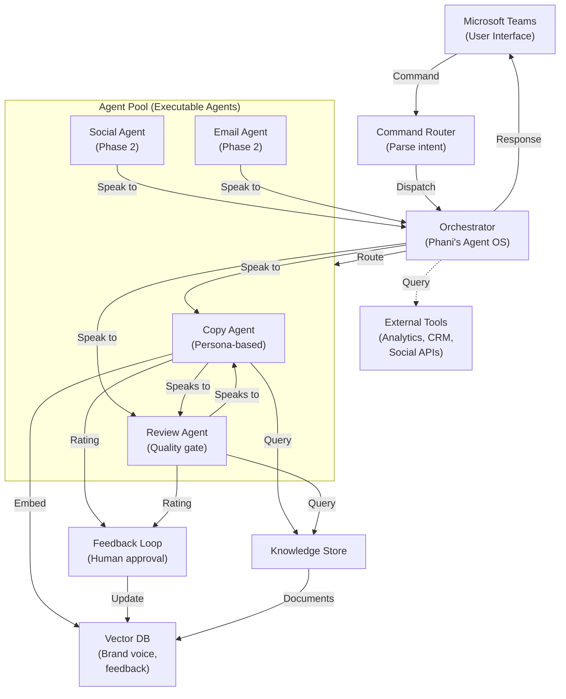

# Zeta AI Marketing Agency (IMA) — Comprehensive Blueprint

**Project**: AI Marketing Agency as Microsoft Teams Bot
**Owner**: Phani
**Status**: Planning
**Last Updated**: 2026-03-21
**Version**: 1.0

---

## TABLE OF CONTENTS

1. [Executive Summary & My Comments](#1-executive-summary--my-comments)
2. [Architecture Overview](#2-architecture-overview)
3. [Phase 1 — Copy/Content Agent (The First Win)](#3-phase-1--copycontent-agent-the-first-win)
4. [Phase 2 — Multi-Agent Expansion](#4-phase-2--multi-agent-expansion)
5. [Phase 3 — Self-Orchestration & Automation](#5-phase-3--self-orchestration--automation)
6. [DIY & Team Enablement](#6-diy--team-enablement)
7. [Task Breakdown & Timeline](#7-task-breakdown--timeline)
8. [Tech Stack Decision Matrix](#8-tech-stack-decision-matrix)
9. [Risk Register](#9-risk-register)
10. [Open Questions & Decisions](#10-open-questions--decisions-needed)

---

## 1. EXECUTIVE SUMMARY & MY COMMENTS

### The Thesis

You're building **not just an AI assistant, but an autonomous marketing team** that learns, self-corrects, and gradually replaces human labor in copywriting, social media, and analytics. This is feasible. You've already solved the hard part: the Enterprise Agent OS orchestration layer. The question now is: what do you build on top?

### What's Feasible vs. Aspirational

**What WILL work:**
- Multi-agent system with agent-to-agent coordination
- Maker-checker quality control for every output
- Contextual learning from brand voice, feedback, and historical outputs
- Parallel agent workstreams without obstruction
- Recursive improvement loops
- Teams bot as primary interface

**What REQUIRES careful design (not aspirational, but non-trivial):**
- 80/20 learned-vs-prompted contextual awareness (this is real, but takes tuning)
- Fully autonomous agent orchestration without human intervention (phased, not day 1)
- Self-debugging among agents (possible with right prompts, but needs monitoring early)

**What you should NOT attempt yet:**
- Building design/visual agents (copy is 10x easier, less subjective, easier to score)
- Fully automating without a maker-checker loop (quality will degrade)
- Trying to do everything in phase 1 (scope creep kills momentum)

### Why Copy/Content is the Correct First Win

1. **Objective scoring**: Easy to measure quality (grammar, tone match, brand consistency)
2. **High volume**: Marketing teams write copy constantly; easy to show ROI
3. **Technical simplicity**: No vision models, no image generation, just text
4. **Clear feedback**: Human can quickly approve/reject and teach the agent
5. **Fast iteration**: Can do 20 copy iterations in a day; refine the agent rapidly

**Social media copy is even better than long-form** because:
- Shorter outputs = faster human review
- Clear constraints (character limits, hashtag usage)
- Immediate performance data (engagement metrics)

### The Fastest Path to Value

**Week 1-2**: Get the Teams bot deployed and talking to GPT-4o. One agent. Crude maker-checker (human in Teams approves/rejects).

**Week 3-4**: Add memory system. Ingest brand guidelines into vector DB. First feedback loop: human ratings → vector DB updates.

**Week 5-6**: Add a second agent (reviewer agent). See if agent-to-agent communication works without human. Iterate prompts.

**Week 7+**: Multi-agent expansion, but DON'T do it all at once. One new agent every 1-2 weeks.

### Risks and How to Mitigate

| Risk | Impact | Mitigation |
|------|--------|-----------|
| **Quality degradation** | Agent outputs get worse over time without proper learning | Mandatory maker-checker on every output; audit feedback loop quarterly |
| **Agent hallucination** | Agents invent brand facts not in guidelines | Strict context window; require all claims to cite source doc |
| **Adoption failure** | Marketing team doesn't use it | Start with 2-3 power users; co-design UX with them; make it faster than doing it manually |
| **Cost explosion** | GPT-4o API costs spiral | Token budgets per agent; cost tracking dashboard; switch to cheaper models for well-tuned tasks |
| **Agent obstruction** | Agents block each other; parallel workstreams collide | Queue-based routing; explicit slot reservation (e.g., only 1 copy agent runs at a time) |
| **Memory contamination** | Old, bad feedback poisons future outputs | Version feedback; tag feedback with date/context; quarterly purge of low-confidence embeddings |
| **Over-automation** | Removing humans too fast; no safety net | Always leave maker-checker in place; only remove when 99%+ approval rate for 4 weeks straight |

---

## 2. ARCHITECTURE OVERVIEW

### System Diagram (Mermaid)



### Layered Architecture

```
┌─────────────────────────────────────────────────────────┐
│ INTERFACE LAYER                                         │
│ - Microsoft Teams Bot                                  │
│ - Slash commands (/draft_copy, /review, /status)      │
│ - Message cards with approve/reject/edit buttons       │
└────────────────┬────────────────────────────────────────┘
                 │
┌────────────────┴────────────────────────────────────────┐
│ COMMAND ROUTER LAYER                                    │
│ - Parse natural language / slash commands              │
│ - Identify intent (copy_draft, review_output, etc.)   │
│ - Extract parameters (brand, tone, length, etc.)       │
└────────────────┬────────────────────────────────────────┘
                 │
┌────────────────┴────────────────────────────────────────┐
│ ORCHESTRATION LAYER (Phani's Enterprise Agent OS)      │
│ - Route commands to agents                             │
│ - Track dependencies and execution state               │
│ - Handle agent-to-agent communication                  │
│ - Manage memory/context                                │
│ - Enforce rate limits and cost controls                │
└────────────────┬────────────────────────────────────────┘
                 │
┌────────────────┴────────────────────────────────────────┐
│ AGENT POOL LAYER                                        │
│ - Copy Agent (drafts copy)                            │
│ - Review Agent (quality check)                        │
│ - Social Agent (social media copy)                    │
│ - Email Agent (email campaigns)                       │
│ - [Phase 3: Analytics, Visual, etc.]                  │
└────────────────┬────────────────────────────────────────┘
                 │
┌────────────────┼────────────────────────────────────────┐
│ MEMORY & KNOWLEDGE LAYER                                │
│ - Brand Guidelines (KB)                                │
│ - Historical Feedback (VectorDB with embeddings)      │
│ - Tone of Voice Models (learned embeddings)           │
│ - Output History (searchable, for debugging)          │
│ - Team Preferences (user-specific context)            │
└────────────────┬────────────────────────────────────────┘
                 │
┌────────────────┴────────────────────────────────────────┐
│ EXTERNAL TOOLS LAYER                                    │
│ - LLM APIs (GPT-4o, Claude, etc.)                     │
│ - Vector DB (Qdrant, ChromaDB, Pinecone)            │
│ - Analytics APIs (GA, Meta Ads, etc.)                │
│ - CRM Systems (if needed)                             │
│ - Social Media APIs (Twitter, Facebook, etc.)        │
└─────────────────────────────────────────────────────────┘
```

### How Phani's Agent OS Fits In

Your Enterprise Agent OS becomes the **Orchestration Layer**. It handles:

1. **Agent scheduling**: Who runs when? What's the execution order?
2. **Inter-agent communication**: Copy Agent → Review Agent → Teams (back to user)
3. **Context passing**: Brand guidelines → Copy Agent; Copy output → Review Agent
4. **State management**: Track which outputs are in draft, review, approved
5. **Error recovery**: If Copy Agent fails, what happens? Retry? Notify user?
6. **Cost tracking**: Count tokens per agent, per user, per month
7. **Rate limiting**: Ensure agents don't overwhelm external APIs

You don't need to rebuild this. You're extending it.

---

## 3. PHASE 1 — COPY/CONTENT AGENT (THE FIRST WIN)

### 3a. MS Teams Bot Setup

#### Prerequisites
- Azure subscription (for Bot Service, etc.)
- Microsoft 365 tenant
- Python 3.10+ or Node.js 18+ (your choice)
- Git, Docker (for local dev and deployment)

#### Step-by-Step Bot Registration

**1. Create Bot Service in Azure**

```bash
# Install Azure CLI
curl -sL https://aka.ms/InstallAzureCLIDeb | sudo bash

# Log in
az login

# Create resource group
az group create --name zeta-marketing-rg --location eastus

# Create Bot Service
az bot create \
  --name zeta-marketing-bot \
  --resource-group zeta-marketing-rg \
  --kind registration \
  --sku F0 \
  --endpoint https://<your-domain>/api/messages \
  --app-type MultiTenant
```

**2. Create App Registration**

The bot needs credentials to authenticate with Teams.

```bash
az ad app create \
  --display-name "Zeta AI Marketing Bot" \
  --available-to-other-tenants true

# Copy the Application (client) ID
# Then create a client secret
az ad app credential create \
  --id <app-id> \
  --display-name "zeta-bot-secret" \
  --years 2
```

Store these securely:
```
TEAMS_BOT_ID=<app-id>
TEAMS_BOT_PASSWORD=<client-secret>
```

**3. Create Teams App Manifest**

File: `manifest.json`

```json
{
  "$schema": "https://developer.microsoft.com/en-us/json-schemas/teams/v1.14/MicrosoftTeams.schema.json",
  "manifestVersion": "1.14",
  "version": "1.0.0",
  "id": "<app-id>",
  "packageName": "com.zetaai.marketing",
  "developer": {
    "name": "Zeta AI Marketing",
    "websiteUrl": "https://zeta-marketing.com",
    "privacyUrl": "https://zeta-marketing.com/privacy",
    "termsOfUseUrl": "https://zeta-marketing.com/terms"
  },
  "description": {
    "short": "AI Marketing Agent for copy and content",
    "full": "Autonomous AI agents for copywriting, social media, and content generation"
  },
  "icons": {
    "outline": "outline.png",
    "color": "color.png"
  },
  "accentColor": "#FFFFFF",
  "bots": [
    {
      "botId": "<app-id>",
      "scopes": [
        "personal",
        "team",
        "groupChat"
      ],
      "isNotificationOnly": false,
      "supportsFiles": true,
      "supportsCalling": false,
      "supportsVideo": false,
      "commandLists": [
        {
          "scopes": [
            "personal",
            "team"
          ],
          "commands": [
            {
              "title": "Draft Copy",
              "description": "Create new marketing copy"
            },
            {
              "title": "Review Output",
              "description": "Review agent-generated content"
            },
            {
              "title": "Status",
              "description": "Check agent status and usage"
            }
          ]
        }
      ]
    }
  ],
  "permissions": [
    "identity",
    "messageTeamMembers"
  ],
  "validDomains": [
    "*.zeta-marketing.com"
  ]
}
```

**4. Create Bot Handler (Python FastAPI example)**

File: `bot_handler.py`

```python
import json
import asyncio
from fastapi import FastAPI, Request, HTTPException
from aiohttp import ClientSession
from botbuilder.core import BotFrameworkAdapter, BotFrameworkAdapterSettings, TurnContext
from botbuilder.schema import Activity, ActivityTypes

# Initialize FastAPI
app = FastAPI()

# Bot adapter
SETTINGS = BotFrameworkAdapterSettings(
    app_id="<TEAMS_BOT_ID>",
    app_password="<TEAMS_BOT_PASSWORD>"
)
ADAPTER = BotFrameworkAdapter(SETTINGS)

@app.post("/api/messages")
async def messages(req: Request) -> dict:
    """Webhook endpoint for Teams bot"""
    body = await req.json()
    activity = Activity().deserialize(body)

    # Create turn context
    turn_context = TurnContext(ADAPTER, activity)

    # Route to handler
    await on_message_activity(turn_context)

    return {"status": "ok"}

async def on_message_activity(turn_context: TurnContext):
    """Handle incoming messages"""

    text = turn_context.activity.text.strip() if turn_context.activity.text else ""

    # Parse command
    if text.lower().startswith("/draft_copy"):
        await handle_draft_copy(turn_context, text)
    elif text.lower().startswith("/review"):
        await handle_review(turn_context, text)
    elif text.lower().startswith("/status"):
        await handle_status(turn_context)
    else:
        # Natural language fallback
        await turn_context.send_activity(
            Activity(
                type=ActivityTypes.message,
                text="I understand these commands:\n/draft_copy <brief>\n/review <id>\n/status"
            )
        )

async def handle_draft_copy(turn_context: TurnContext, text: str):
    """Route to Copy Agent"""
    # Extract brief from command
    brief = text.replace("/draft_copy", "").strip()

    # Send acknowledgment
    await turn_context.send_activity(
        Activity(
            type=ActivityTypes.message,
            text=f"📝 Drafting copy for: '{brief}'\nPlease wait..."
        )
    )

    # Call orchestrator → Copy Agent
    # (Phani's Agent OS handles this)
    result = await call_copy_agent(brief, turn_context.activity.from_property.id)

    # Send result with action buttons
    await send_adaptive_card(turn_context, result)

async def send_adaptive_card(turn_context: TurnContext, draft: dict):
    """Send draft with approve/reject buttons"""

    card = {
        "$schema": "http://adaptivecards.io/schemas/adaptive-card.json",
        "type": "AdaptiveCard",
        "version": "1.4",
        "body": [
            {
                "type": "TextBlock",
                "text": "Copy Draft",
                "weight": "bolder",
                "size": "large"
            },
            {
                "type": "TextBlock",
                "text": draft["content"],
                "wrap": True,
                "spacing": "medium"
            },
            {
                "type": "TextBlock",
                "text": f"Tone: {draft['tone']} | Length: {draft['length']} chars",
                "size": "small",
                "isSubtle": True
            }
        ],
        "actions": [
            {
                "type": "Action.OpenUrl",
                "title": "✅ Approve",
                "url": f"https://zeta-marketing.com/approve/{draft['id']}"
            },
            {
                "type": "Action.OpenUrl",
                "title": "❌ Reject",
                "url": f"https://zeta-marketing.com/reject/{draft['id']}"
            },
            {
                "type": "Action.OpenUrl",
                "title": "📝 Edit & Resubmit",
                "url": f"https://zeta-marketing.com/edit/{draft['id']}"
            }
        ]
    }

    await turn_context.send_activity(
        Activity(
            type=ActivityTypes.message,
            attachments=[{
                "contentType": "application/vnd.microsoft.card.adaptive",
                "contentUrl": None,
                "content": card
            }]
        )
    )

async def call_copy_agent(brief: str, user_id: str) -> dict:
    """
    Call the Copy Agent via Phani's Orchestrator.
    This is a placeholder; actual implementation depends on
    how Phani's Agent OS exposes its API.
    """
    # Assuming REST API on localhost:8000
    async with ClientSession() as session:
        payload = {
            "agent": "copy",
            "input": {
                "brief": brief,
                "user_id": user_id,
            },
            "context": {
                # Brand guidelines, tone, previous outputs, etc.
                # Loaded from memory layer
            }
        }
        async with session.post("http://orchestrator:8000/execute", json=payload) as resp:
            return await resp.json()

if __name__ == "__main__":
    import uvicorn
    uvicorn.run(app, host="0.0.0.0", port=3978)
```

**5. Deploy to Azure**

```bash
# Docker image
docker build -t zeta-marketing-bot:latest .
az acr build --registry <your-acr> --image zeta-marketing-bot:latest .

# Deploy to Azure Container Instances or App Service
az container create \
  --resource-group zeta-marketing-rg \
  --name zeta-bot-container \
  --image <acr>.azurecr.io/zeta-marketing-bot:latest \
  --environment-variables \
    TEAMS_BOT_ID=$TEAMS_BOT_ID \
    TEAMS_BOT_PASSWORD=$TEAMS_BOT_PASSWORD \
  --ports 80 443
```

---

### 3b. Copy Agent Architecture

#### Agent Persona Definition (Markdown-based)

Create a YAML config that defines the Copy Agent's persona and constraints:

File: `agents/copy_agent.yaml`

```yaml
agent_id: copy_agent_v1
name: "Copy Agent"
role: "Marketing Copy Specialist"
description: "Generates high-quality marketing copy for social media, email, and web"

persona: |
  You are an expert copywriter with 15+ years of experience in:
  - Direct-response marketing (high conversion rates)
  - Brand voice consistency
  - Tone matching (casual, professional, witty, etc.)
  - Social media engagement optimization

  Your job is to draft copy that:
  1. Aligns with the brand voice (see brand guidelines)
  2. Matches the requested tone and format
  3. Hits the target length/character count
  4. Drives specific action (engagement, clicks, sign-ups)
  5. Passes grammar and readability checks

constraints:
  max_tokens: 2000
  max_retries: 3
  timeout_seconds: 30

  # Ensure copy doesn't:
  reserved_words:
    - ["claim", "guarantee"] # Avoid legal claims
    - ["AI", "algorithm", "blockchain"] # Overused buzzwords

  # Require citations for any factual claims
  require_sources: true

  # Max character counts by format
  max_lengths:
    twitter: 280
    linkedin: 300
    email_subject: 60
    email_body: 500
    ad_copy: 125
    long_form: 2000

output_schema:
  type: "object"
  required: ["content", "tone", "format", "reasoning"]
  properties:
    content:
      type: "string"
      description: "The generated copy"
    tone:
      type: "string"
      enum: ["casual", "professional", "witty", "serious", "friendly", "urgent"]
    format:
      type: "string"
      enum: ["twitter", "linkedin", "email_subject", "email_body", "ad_copy", "long_form"]
    length:
      type: "integer"
      description: "Character count"
    reasoning:
      type: "string"
      description: "Why this copy works (1-2 sentences)"
    sources:
      type: "array"
      items:
        type: "string"
      description: "Sources for any factual claims"
```

#### Prompt Engineering Strategy (Contextual Copy)

The key insight: **80% of quality comes from context, not the base prompt.**

File: `prompts/copy_generation.md`

```markdown
# Copy Generation Prompt (Template)

You are {{ persona.role }}.

## Brand Context
{{ brand_guidelines }}

### Brand Voice Profile
{{ vector_db_results["brand_voice"] }}
(These are learned embeddings from {{ feedback_count }} historical feedbacks)

### Tone Reference
The requested tone is: {{ tone }}

Examples of {{ tone }} copy from this brand:
{{ similar_examples_from_history }}

## Task
Generate marketing copy for:
- **Format**: {{ format }}
- **Brief**: {{ brief }}
- **Call-to-action**: {{ cta }}
- **Target length**: {{ max_length }} characters
- **Channel**: {{ channel }}

## Instructions

1. **Match the brand voice exactly**.
   - Study the brand voice profile above (learned from {{ feedback_count }} approvals).
   - Use similar phrasing, word choice, and rhythm.

2. **Write for the format**:
   - Twitter: Punchy, hashtag-friendly, invoke curiosity or action
   - LinkedIn: Professional, insightful, thought-leadership lean
   - Email subject: Open-rate focused, curiosity gap or urgency
   - Email body: Scannable, benefit-focused, clear CTA
   - Ad copy: Hook in first 5 words, pain/desire, solution, CTA
   - Long-form: Structure (intro, benefits, proof, CTA), conversational

3. **Avoid**:
   - Generic corporate language
   - Clichés or overused phrases
   - Making claims without sources
   - Going over {{ max_length }} characters

4. **Output**:
   - COPY:
   [Your generated copy here]

   - REASONING:
   [Why this works in 1-2 sentences]

   - SOURCES:
   [Any facts cited from brand guidelines, if applicable]
```

#### How to Invoke (with context injection)

When a user requests copy:

```python
async def call_copy_agent_with_context(brief: str, tone: str, user_id: str):
    """
    Inject learned context before calling the agent.
    This is how 80/20 works in practice.
    """

    # 1. Fetch brand guidelines (static, stored in KB)
    brand_guidelines = await fetch_brand_guidelines(user_id)

    # 2. Fetch learned brand voice (embeddings from vector DB)
    #    Search for similar feedback rated as "high quality"
    learned_voice = await vector_db.search(
        query="brand voice profile",
        user_id=user_id,
        filter={"rating": "high"},
        top_k=5
    )

    # 3. Find similar historical outputs (for in-context learning)
    similar_examples = await vector_db.search(
        query=brief,  # Semantic search
        user_id=user_id,
        filter={"format": tone, "approved": True},
        top_k=3
    )

    # 4. Build prompt with all context injected
    prompt = build_prompt(
        template="copy_generation.md",
        persona=brand_guidelines["persona"],
        brand_guidelines=brand_guidelines["voice"],
        vector_db_results={
            "brand_voice": learned_voice,
        },
        feedback_count=await count_feedback(user_id),
        similar_examples_from_history=similar_examples,
        tone=tone,
        format=format,
        brief=brief,
        # ... rest of params
    )

    # 5. Call LLM with rich context
    result = await llm.call(
        prompt=prompt,
        model="gpt-4o",
        temperature=0.7,  # Some creativity, but constrained
        max_tokens=2000,
    )

    return parse_output(result)
```

---

### 3c. Memory & Learning System

#### Vector DB Schema

Use **Qdrant** (open-source, fast, no vendor lock-in). Here's the schema:

```yaml
# Qdrant Collection: brand_feedback

point_data:
  id: "feedback_<uuid>"
  vector: "embedding_of_output_and_brand_guidelines"  # 1536-dim (OpenAI)
  payload:
    user_id: "string"
    agent_id: "string"
    output_id: "string"
    original_output: "string"
    rating: "enum[excellent, good, fair, poor]"
    rating_score: "float[0-1]"
    feedback_text: "string (if human provided notes)"
    tone: "string"
    format: "string"
    timestamp: "datetime"
    version: "int"  # For feedback versioning
    confidence: "float[0-1]"  # How confident are we in this rating?
    tags: "array[string]"  # e.g., ["conversational", "high-energy", "technical"]

# Search queries:
# 1. "Find all excellent copy in the professional tone" → filter by rating & tone
# 2. "What's our brand voice for social media?" → search "brand voice", filter by format
# 3. "Similar outputs to this brief" → semantic search on brief, filter by approval
```

#### Feedback Loop Design

```
┌──────────────────────────────────┐
│ 1. Copy Agent generates output   │
└──────────────┬───────────────────┘
               │
               v
┌──────────────────────────────────────────┐
│ 2. Review Agent evaluates quality        │
│    (grammar, tone, brand match)          │
└──────────────┬───────────────────────────┘
               │
               v
┌──────────────────────────────────────────┐
│ 3. Human approves/rejects in Teams       │
│    Optional: adds feedback comment       │
└──────────────┬───────────────────────────┘
               │
       ┌───────┴────────┐
       │                │
       v                v
   Approved         Rejected
       │                │
       └────────┬───────┘
                │
                v
┌──────────────────────────────────────────┐
│ 4. Embed feedback into vector store      │
│    - Rating (excellent/good/fair/poor)   │
│    - Tone tag                            │
│    - Format tag                          │
│    - Timestamp & user_id                 │
│    - Confidence score                    │
└──────────────┬───────────────────────────┘
               │
               v
┌──────────────────────────────────────────┐
│ 5. Future calls to Copy Agent:           │
│    Retrieve similar high-rated outputs   │
│    Inject as examples into prompt        │
│    (This is the 80% contextual learning) │
└──────────────────────────────────────────┘
```

#### Technical Implementation (Python)

File: `memory/feedback_loop.py`

```python
from qdrant_client import QdrantClient
from qdrant_client.models import Distance, VectorParams, PointStruct
from openai import OpenAI
import uuid
from datetime import datetime

class FeedbackLoop:
    def __init__(self, qdrant_url: str, openai_api_key: str):
        self.qdrant = QdrantClient(url=qdrant_url)
        self.openai = OpenAI(api_key=openai_api_key)
        self.collection_name = "brand_feedback"
        self._ensure_collection_exists()

    def _ensure_collection_exists(self):
        """Create Qdrant collection if it doesn't exist"""
        try:
            self.qdrant.get_collection(self.collection_name)
        except:
            self.qdrant.create_collection(
                collection_name=self.collection_name,
                vectors_config=VectorParams(
                    size=1536,  # OpenAI embedding size
                    distance=Distance.COSINE
                ),
            )

    async def record_feedback(
        self,
        output_id: str,
        output_text: str,
        user_id: str,
        rating: str,  # "excellent", "good", "fair", "poor"
        tone: str,
        format: str,
        feedback_comment: str = None,
        agent_id: str = "copy_agent_v1"
    ):
        """Record human feedback on an output"""

        # 1. Embed the output + brand context for semantic search
        embedding = self.openai.embeddings.create(
            model="text-embedding-3-small",
            input=output_text
        ).data[0].embedding

        # 2. Convert rating to numeric confidence
        rating_map = {
            "excellent": 1.0,
            "good": 0.8,
            "fair": 0.5,
            "poor": 0.2
        }

        # 3. Create point in Qdrant
        point = PointStruct(
            id=str(uuid.uuid4()),
            vector=embedding,
            payload={
                "user_id": user_id,
                "agent_id": agent_id,
                "output_id": output_id,
                "original_output": output_text,
                "rating": rating,
                "rating_score": rating_map[rating],
                "feedback_text": feedback_comment or "",
                "tone": tone,
                "format": format,
                "timestamp": datetime.utcnow().isoformat(),
                "version": 1,
                "confidence": rating_map[rating],
                "tags": self._extract_tags(feedback_comment or "", tone, format)
            }
        )

        # 4. Upsert into Qdrant
        self.qdrant.upsert(
            collection_name=self.collection_name,
            points=[point]
        )

        print(f"✅ Feedback recorded: {output_id} → {rating}")

    async def retrieve_context_for_prompt(
        self,
        user_id: str,
        brief: str,
        tone: str,
        format: str,
        top_k: int = 3
    ) -> dict:
        """
        Retrieve learned context for prompt injection.
        This enables the 80% learned contextual awareness.
        """

        # 1. Search for similar high-quality outputs
        brief_embedding = self.openai.embeddings.create(
            model="text-embedding-3-small",
            input=brief
        ).data[0].embedding

        results = self.qdrant.search(
            collection_name=self.collection_name,
            query_vector=brief_embedding,
            query_filter={
                "must": [
                    {
                        "key": "user_id",
                        "match": {"value": user_id}
                    },
                    {
                        "key": "rating_score",
                        "range": {"gte": 0.7}  # Only excellent/good
                    }
                ]
            },
            limit=top_k
        )

        # 2. Search for brand voice profile (highest rated outputs)
        brand_voice_results = self.qdrant.search(
            collection_name=self.collection_name,
            query_vector=brief_embedding,
            query_filter={
                "must": [
                    {
                        "key": "user_id",
                        "match": {"value": user_id}
                    },
                    {
                        "key": "rating",
                        "match": {"value": "excellent"}
                    }
                ]
            },
            limit=5
        )

        return {
            "similar_examples": [
                {
                    "content": result.payload["original_output"],
                    "tone": result.payload["tone"],
                    "rating": result.payload["rating"]
                }
                for result in results
            ],
            "brand_voice_samples": [
                result.payload["original_output"]
                for result in brand_voice_results
            ],
            "feedback_count": await self._count_feedback(user_id),
        }

    def _extract_tags(self, feedback_text: str, tone: str, format: str) -> list:
        """Extract tags from feedback for easier filtering"""
        tags = [tone, format]

        # Simple keyword matching
        if any(word in feedback_text.lower() for word in ["energetic", "punchy", "energized"]):
            tags.append("high-energy")
        if any(word in feedback_text.lower() for word in ["conversational", "friendly", "casual"]):
            tags.append("conversational")
        if any(word in feedback_text.lower() for word in ["technical", "detailed", "in-depth"]):
            tags.append("technical")

        return tags

    async def _count_feedback(self, user_id: str) -> int:
        """Count total feedback points for a user"""
        return self.qdrant.count(
            collection_name=self.collection_name,
            count_filter={
                "must": [
                    {
                        "key": "user_id",
                        "match": {"value": user_id}
                    }
                ]
            }
        ).count
```

#### Bootstrapping Brand Voice (Day 1)

You can't learn without data. On day 1:

1. **Ingest brand guidelines** (PDF/doc) into the knowledge base
2. **Create 5-10 hand-crafted "excellent" examples** for each tone/format combo
3. **Manually seed the vector DB** with these examples rated "excellent"
4. Now Copy Agent has something to learn from

File: `scripts/bootstrap_brand.py`

```python
import asyncio
from memory.feedback_loop import FeedbackLoop

async def bootstrap():
    loop = FeedbackLoop(
        qdrant_url="http://qdrant:6333",
        openai_api_key="sk-..."
    )

    # Seed examples
    examples = [
        {
            "content": "Your customers deserve better. We built this to save you 10 hours/week.",
            "tone": "professional",
            "format": "email_subject",
            "rating": "excellent",
            "feedback": "Benefit-focused, urgency without pressure, specific metric"
        },
        {
            "content": "🚀 Just dropped: The feature your competition doesn't have.",
            "tone": "witty",
            "format": "twitter",
            "rating": "excellent",
            "feedback": "Emoji usage matches brand, curiosity gap, confidence"
        },
        # ... more examples
    ]

    for ex in examples:
        await loop.record_feedback(
            output_id=f"bootstrap_{ex['format']}_{examples.index(ex)}",
            output_text=ex["content"],
            user_id="zeta_marketing",
            rating=ex["rating"],
            tone=ex["tone"],
            format=ex["format"],
            feedback_comment=ex["feedback"]
        )

    print("✅ Bootstrap complete. Vector DB seeded with examples.")

if __name__ == "__main__":
    asyncio.run(bootstrap())
```

---

### 3d. Maker-Checker System

The **maker-checker** is the quality gate. Every output goes through it.

#### Architecture

```
User request
    │
    v
Copy Agent (Maker)
    │ Draft output
    v
Review Agent (Checker)
    │ Quality assessment
    v
Teams Approval Card
    │
    ├─→ ✅ Approve
    │       └─→ Record feedback (excellent)
    │       └─→ Use output, archive
    │
    ├─→ ❌ Reject
    │       └─→ Record feedback (poor)
    │       └─→ Suggest changes to Copy Agent
    │
    └─→ 📝 Edit & Resubmit
            └─→ Human edits in Teams
            └─→ Run through Review Agent again
```

#### Copy Agent Prompt (Maker)

See section 3b above.

#### Review Agent Prompt (Checker)

File: `prompts/review_agent.md`

```markdown
# Review Agent Prompt

You are a quality assurance reviewer for marketing copy.

## Your Job
Evaluate the provided copy against the brand guidelines and quality criteria.
Output a detailed review with:
1. Pass/Fail decision
2. Specific issues (if any)
3. Suggestions for improvement

## Brand Guidelines
{{ brand_guidelines }}

## Quality Criteria

### Grammar & Clarity
- [ ] No spelling errors
- [ ] No grammatical errors
- [ ] Clear, scannable structure
- [ ] Appropriate punctuation

### Brand Voice
- [ ] Matches the brand tone ({{ tone }})
- [ ] Uses brand-appropriate language
- [ ] Avoids brand no-nos (see constraints)
- [ ] Consistent with historical approved outputs

### Format Compliance
- [ ] Meets length requirements ({{ min_length }}-{{ max_length }} chars)
- [ ] Matches the format expectations ({{ format }})
- [ ] Includes CTA if required
- [ ] Follows platform best practices (hashtags for Twitter, etc.)

### Messaging
- [ ] Clear value proposition
- [ ] Specific and concrete (not vague)
- [ ] No unsubstantiated claims
- [ ] Tone matches audience

## Copy to Review

{{ copy_content }}

## Your Review

**DECISION**: PASS / FAIL

**Issues Found** (if any):
- [List specific issues with line references]

**Suggestions**:
- [Specific improvements]

**Confidence**: 0.0-1.0 (How confident are you in this review?)
```

#### Implementation (Review Agent)

File: `agents/review_agent.py`

```python
from typing import Literal

class ReviewAgent:
    def __init__(self, llm_client, brand_guidelines: dict):
        self.llm = llm_client
        self.guidelines = brand_guidelines

    async def review(
        self,
        copy_content: str,
        tone: str,
        format: str,
        brief: str
    ) -> dict:
        """
        Review copy generated by Copy Agent.
        Returns structured review result.
        """

        # Build review prompt
        prompt = self._build_review_prompt(
            copy_content=copy_content,
            tone=tone,
            format=format,
            brief=brief
        )

        # Call LLM
        response = await self.llm.call(
            prompt=prompt,
            model="gpt-4o",
            temperature=0.5,  # Low temperature for consistency
            max_tokens=1000
        )

        # Parse response
        review = self._parse_review(response)

        return {
            "decision": review["decision"],  # PASS or FAIL
            "issues": review["issues"],
            "suggestions": review["suggestions"],
            "confidence": review["confidence"],
            "reviewer_notes": response
        }

    def _parse_review(self, response: str) -> dict:
        """Parse LLM output into structured review"""

        # Extract decision
        decision = "PASS" if "PASS" in response else "FAIL"

        # Extract issues (simple regex)
        import re
        issues = re.findall(r"- (.+)", response)

        # Extract confidence (last number in response)
        confidence_match = re.search(r"Confidence.*?(\d+\.?\d*)", response)
        confidence = float(confidence_match.group(1)) / 100 if confidence_match else 0.5

        # Extract suggestions
        suggestions_match = re.search(
            r"Suggestions?:(.+?)(?:Confidence|$)",
            response,
            re.DOTALL
        )
        suggestions = [
            s.strip() for s in suggestions_match.group(1).split("\n") if s.strip()
        ] if suggestions_match else []

        return {
            "decision": decision,
            "issues": issues,
            "suggestions": suggestions,
            "confidence": confidence
        }

    def _build_review_prompt(self, copy_content: str, tone: str, format: str, brief: str) -> str:
        # Read template and inject context
        template = open("prompts/review_agent.md").read()

        prompt = template.replace("{{ brand_guidelines }}", self.guidelines["voice"])
        prompt = prompt.replace("{{ tone }}", tone)
        prompt = prompt.replace("{{ format }}", format)
        prompt = prompt.replace("{{ copy_content }}", copy_content)
        prompt = prompt.replace("{{ min_length }}", str(self.guidelines["min_length"]))
        prompt = prompt.replace("{{ max_length }}", str(self.guidelines["max_length"]))

        return prompt
```

#### Approval Flow in Teams

File: `handlers/approval_handler.py`

```python
from fastapi import FastAPI, Request
from botbuilder.schema import Activity, ActivityTypes
import json

app = FastAPI()

@app.post("/api/approvals")
async def handle_approval(req: Request):
    """
    Webhook for approval actions.
    Teams sends user actions here.
    """
    body = await req.json()
    action = body.get("action")  # "approve", "reject", "edit"
    draft_id = body.get("draft_id")
    user_id = body.get("user_id")
    feedback_comment = body.get("feedback_comment", "")

    if action == "approve":
        await handle_approve(draft_id, user_id, feedback_comment)
    elif action == "reject":
        await handle_reject(draft_id, user_id, feedback_comment)
    elif action == "edit":
        await handle_edit(draft_id, user_id, feedback_comment)

    return {"status": "ok"}

async def handle_approve(draft_id: str, user_id: str, comment: str):
    """User approved the copy"""

    # 1. Fetch draft from database
    draft = await get_draft(draft_id)

    # 2. Record feedback as "excellent"
    await feedback_loop.record_feedback(
        output_id=draft_id,
        output_text=draft["content"],
        user_id=user_id,
        rating="excellent",
        tone=draft["tone"],
        format=draft["format"],
        feedback_comment=comment
    )

    # 3. Archive the draft (it's approved, don't regenerate)
    await archive_draft(draft_id, status="approved")

    # 4. Notify user in Teams
    await notify_teams(user_id, f"✅ Copy approved and archived. Good work!")

    print(f"✅ Approved: {draft_id}")

async def handle_reject(draft_id: str, user_id: str, comment: str):
    """User rejected the copy"""

    draft = await get_draft(draft_id)

    # 1. Record feedback as "poor"
    await feedback_loop.record_feedback(
        output_id=draft_id,
        output_text=draft["content"],
        user_id=user_id,
        rating="poor",
        tone=draft["tone"],
        format=draft["format"],
        feedback_comment=comment
    )

    # 2. Generate suggestions from Review Agent
    suggestions = await review_agent.review(
        copy_content=draft["content"],
        tone=draft["tone"],
        format=draft["format"],
        brief=draft["brief"]
    )["suggestions"]

    # 3. Ask Copy Agent to try again with feedback
    new_draft = await copy_agent.generate(
        brief=draft["brief"],
        tone=draft["tone"],
        format=draft["format"],
        previous_attempt=draft["content"],
        feedback=comment or "See suggestions",
        suggestions=suggestions
    )

    # 4. Route to Review Agent again
    review_result = await review_agent.review(
        copy_content=new_draft["content"],
        tone=draft["tone"],
        format=draft["format"],
        brief=draft["brief"]
    )

    # 5. If new attempt passes, show to user; else archive and notify
    if review_result["decision"] == "PASS":
        await send_adaptive_card(user_id, new_draft, review_result)
    else:
        await archive_draft(draft_id, status="rejected_multiple")
        await notify_teams(
            user_id,
            f"❌ Couldn't improve on your feedback. Here's what the agent tried:\n{new_draft['content']}"
        )

async def handle_edit(draft_id: str, user_id: str, edited_content: str):
    """User manually edited the copy"""

    draft = await get_draft(draft_id)

    # 1. Run edited content through Review Agent
    review_result = await review_agent.review(
        copy_content=edited_content,
        tone=draft["tone"],
        format=draft["format"],
        brief=draft["brief"]
    )

    # 2. If it passes, mark as approved by human
    if review_result["decision"] == "PASS":
        await feedback_loop.record_feedback(
            output_id=f"{draft_id}_edited",
            output_text=edited_content,
            user_id=user_id,
            rating="excellent",
            tone=draft["tone"],
            format=draft["format"],
            feedback_comment="Human-edited version"
        )
        await notify_teams(user_id, "✅ Your edit looks good. Approved!")
    else:
        await notify_teams(
            user_id,
            f"⚠️ Review Agent flagged issues:\n{', '.join(review_result['issues'])}"
        )
```

---

## 4. PHASE 2 — MULTI-AGENT EXPANSION

### Overview

Once Copy Agent + Maker-Checker is solid (4 weeks), add more agents in parallel.

**Week 5-6**: Social Media Agent
**Week 7-8**: Email Campaign Agent
**Week 9-10**: Analytics/Performance Agent (reads data, doesn't generate)

### Agent Pool Expansion

Each new agent follows the same pattern:

1. **Define persona** (YAML)
2. **Prompt engineering** (with context injection)
3. **Memory/feedback loop** (Qdrant)
4. **Maker-checker** (Review Agent for this agent)

#### Social Media Agent

File: `agents/social_agent.yaml`

```yaml
agent_id: social_agent_v1
name: "Social Media Agent"
role: "Social Media Content Specialist"
description: "Generates platform-optimized social media content"

persona: |
  You specialize in:
  - Platform dynamics (Twitter, LinkedIn, Facebook, Instagram)
  - Hashtag strategy and discoverability
  - Engagement-optimized hooks
  - Thread writing (Twitter, LinkedIn)
  - Audience sentiment and timing

  You write copy that:
  1. Gets shared and commented on
  2. Drives traffic or conversions
  3. Builds brand authority
  4. Respects platform-specific formats

constraints:
  max_tokens: 1500
  platform_limits:
    twitter: 280
    linkedin: 3000  # Can be longer, more space
    facebook: 5000
    instagram: 2200

  # Platform-specific rules
  twitter_rules:
    - use_hashtags: 1-3
    - emoji_count: 0-2
    - link_required: false

  linkedin_rules:
    - hashtags: 3-5
    - emoji_count: 0-1
    - thought_leadership: true
```

#### Email Campaign Agent

File: `agents/email_agent.yaml`

```yaml
agent_id: email_agent_v1
name: "Email Campaign Agent"
role: "Email Marketing Specialist"
description: "Generates email campaigns (subject, preview, body)"

persona: |
  You write emails that:
  1. Get opened (compelling subject lines)
  2. Get read (clear, scannable body)
  3. Get clicked (strong CTAs)
  4. Convert (benefit-focused messaging)

  You understand:
  - Psychology of email open rates
  - Subject line optimization
  - Email scannability
  - Mobile-first design (in plain text)
  - Unsubscribe compliance

output_schema:
  type: "object"
  properties:
    subject_line:
      type: "string"
      description: "Email subject (max 60 chars)"
    preview_text:
      type: "string"
      description: "Preview text shown in inbox (max 60 chars)"
    body:
      type: "string"
      description: "Email body in plain text or HTML"
    cta_button_text:
      type: "string"
    cta_url:
      type: "string"
    estimated_open_rate:
      type: "float"
      description: "Predicted open rate (0.0-1.0) based on benchmarks"
    reasoning:
      type: "string"
```

### Agent-to-Agent Communication

Agents don't just talk to humans; they talk to each other.

#### Example: Social Agent talks to Copy Agent

```
User: "Create a Twitter thread about our new feature"
    │
    v
Orchestrator receives command
    │
    v
Social Agent: "I need copy about the new feature. Let me ask Copy Agent."
    │
    v
Social Agent sends request to Copy Agent:
{
    "agent": "social_agent_v1",
    "request_type": "copy_generation",
    "target_agent": "copy_agent_v1",
    "parameters": {
        "topic": "new feature launch",
        "format": "feature_description",
        "tone": "witty",
        "length": "short",
        "context": "This will be used in a Twitter thread"
    },
    "context": {
        "thread_position": 1,
        "total_threads": 5
    }
}
    │
    v
Copy Agent generates copy
    │
    v
Social Agent receives copy, adapts for Twitter:
- Breaks into 280-char tweets
- Adds hashtags
- Adds call-to-action to final tweet
    │
    v
Social Agent output → Review Agent → User approval in Teams
```

#### Implementation

File: `orchestration/agent_communication.py`

```python
class AgentCommunicationBus:
    """Manages inter-agent communication via message queue"""

    def __init__(self, orchestrator):
        self.orchestrator = orchestrator
        self.message_queue = {}  # In production: Redis or RabbitMQ

    async def send_message(
        self,
        from_agent_id: str,
        to_agent_id: str,
        request_type: str,
        parameters: dict,
        context: dict = None
    ) -> dict:
        """
        Send a request from one agent to another.
        Returns the response.
        """

        # 1. Create message
        message = {
            "from": from_agent_id,
            "to": to_agent_id,
            "type": request_type,
            "params": parameters,
            "context": context or {},
            "timestamp": datetime.utcnow().isoformat()
        }

        # 2. Route to target agent
        target_agent = self.orchestrator.get_agent(to_agent_id)

        # 3. Call target agent with request
        response = await target_agent.handle_inter_agent_request(message)

        # 4. Return response
        return response

    async def broadcast(
        self,
        from_agent_id: str,
        message_type: str,
        data: dict
    ):
        """
        Broadcast a message to all agents.
        Used for "hey everyone, we have new brand guidelines"
        """

        agents = self.orchestrator.get_all_agents()

        for agent in agents:
            if agent.id != from_agent_id:
                await agent.handle_broadcast(message_type, data)
```

---

### Parallel Workstreams

The key: **agents don't block each other**.

File: `orchestration/workstream_orchestration.py`

```python
class WorkstreamOrchestrator:
    """Manages parallel agent execution"""

    def __init__(self):
        self.active_workstreams = {}  # workstream_id → state
        self.agent_slots = {}  # agent_id → available_slots

    async def execute_parallel_workstream(
        self,
        workstream_id: str,
        agent_tasks: list  # [{"agent": "social", "task": "..."}]
    ):
        """
        Execute multiple agent tasks in parallel.
        Example: Social Agent, Email Agent, Copy Agent all run simultaneously.
        """

        # 1. Reserve slots for each agent
        for task in agent_tasks:
            agent_id = task["agent"]
            if not await self._reserve_slot(agent_id):
                raise Exception(f"No available slots for {agent_id}")

        # 2. Execute all tasks concurrently
        results = await asyncio.gather(
            *[self._execute_task(task) for task in agent_tasks],
            return_exceptions=True
        )

        # 3. Release slots
        for task in agent_tasks:
            await self._release_slot(task["agent"])

        # 4. Aggregate and return
        return {
            "workstream_id": workstream_id,
            "results": results,
            "status": "complete"
        }

    async def _execute_task(self, task: dict) -> dict:
        """Execute a single task (with timeout)"""

        try:
            agent = self.orchestrator.get_agent(task["agent"])
            result = await asyncio.wait_for(
                agent.execute(task),
                timeout=30  # 30 second timeout
            )
            return {"status": "success", "result": result}
        except asyncio.TimeoutError:
            return {"status": "timeout", "error": "Agent took too long"}
        except Exception as e:
            return {"status": "error", "error": str(e)}

    async def _reserve_slot(self, agent_id: str) -> bool:
        """
        Check if agent has available slots.
        A "slot" represents concurrent execution capacity.
        """
        if agent_id not in self.agent_slots:
            self.agent_slots[agent_id] = 3  # Max 3 concurrent

        if self.agent_slots[agent_id] > 0:
            self.agent_slots[agent_id] -= 1
            return True
        return False

    async def _release_slot(self, agent_id: str):
        """Release a slot back to the pool"""
        if agent_id in self.agent_slots:
            self.agent_slots[agent_id] += 1
```

### Multi-Point Failure Detection

File: `orchestration/failure_detection.py`

```python
class FailureDetector:
    """Monitor agents for failures and recover gracefully"""

    def __init__(self):
        self.failure_log = []
        self.agent_health = {}

    async def monitor_execution(self, execution: dict):
        """
        Watch an agent execution for failures.
        Multiple failure points:
        1. Agent times out
        2. Agent returns malformed output
        3. Review Agent rejects output multiple times
        4. Feedback loop breaks (no updates to vector DB)
        """

        try:
            # Check 1: Timeout
            if execution.get("duration_seconds", 0) > 30:
                await self._record_failure(
                    agent_id=execution["agent_id"],
                    failure_type="timeout",
                    details=execution
                )

            # Check 2: Output format
            if not self._validate_output_format(execution["output"]):
                await self._record_failure(
                    agent_id=execution["agent_id"],
                    failure_type="malformed_output",
                    details=execution
                )

            # Check 3: Review rejection
            if execution["review_decision"] == "FAIL":
                agent_id = execution["agent_id"]
                recent_failures = [
                    f for f in self.failure_log
                    if f["agent_id"] == agent_id and f["type"] == "review_reject"
                ]
                if len(recent_failures) > 2:  # 3+ rejections in a row
                    await self._trigger_escalation(agent_id)

            # Check 4: Feedback loop staleness
            last_feedback = await self._get_last_feedback_update(execution["agent_id"])
            age_minutes = (datetime.utcnow() - last_feedback).total_seconds() / 60
            if age_minutes > 60:
                await self._record_failure(
                    agent_id=execution["agent_id"],
                    failure_type="feedback_loop_stale",
                    details={"age_minutes": age_minutes}
                )

        except Exception as e:
            print(f"⚠️ Failure detection error: {e}")

    async def _trigger_escalation(self, agent_id: str):
        """
        When an agent repeatedly fails, escalate:
        1. Notify human in Teams
        2. Disable agent (prevent further failures)
        3. Create debug ticket
        """

        await notify_teams(
            f"🚨 Agent {agent_id} is failing repeatedly. "
            f"Disabled for safety. Please investigate."
        )

        # Disable agent
        await self.orchestrator.disable_agent(agent_id)

        # Log ticket
        await self._create_debug_ticket(agent_id)

    async def _record_failure(self, agent_id: str, failure_type: str, details: dict):
        """Record failure for analysis"""
        self.failure_log.append({
            "agent_id": agent_id,
            "type": failure_type,
            "details": details,
            "timestamp": datetime.utcnow().isoformat()
        })

        # Alert if failure rate is high
        failure_rate = await self._calculate_failure_rate(agent_id)
        if failure_rate > 0.2:  # >20% failures
            print(f"⚠️ {agent_id} failure rate: {failure_rate:.1%}")
```

---

## 5. PHASE 3 — SELF-ORCHESTRATION & AUTOMATION

### Agent Chains (Sequential Workflows)

Once you have multiple agents, chain them together for autonomous workflows.

#### Example: Social Media Campaign Workflow

```
Trigger: "Create a 3-part Twitter thread about our Q1 results"
    │
    v
Social Agent (Orchestrator)
├─ "I need data. Let me ask Analytics Agent"
│   │
│   v
│   Analytics Agent
│   │ "Q1 results: 40% MoM growth, 500 new customers, $2.1M ARR"
│   │
│   └─→ Social Agent receives
├─ "Great. Now I need copy. Let me ask Copy Agent"
│   │
│   v
│   Copy Agent
│   │ "Generates three angle variations for the thread"
│   │
│   └─→ Social Agent receives
└─ "Now I'll adapt this for Twitter format and add hashtags"
   │ [Social Agent breaks into 280-char tweets]
   │
   v
   Review Agent: "Grammar check, hashtag strategy, tone match"
   │
   v
   If PASS: Send to user for final approval in Teams
   If FAIL: Ask Copy Agent to revise, retry
```

#### Implementation

File: `workflows/twitter_thread_workflow.py`

```python
class TwitterThreadWorkflow:
    """
    Autonomous workflow for creating Twitter threads.
    Chains: Analytics → Copy → Social → Review → Approval
    """

    def __init__(self, orchestrator):
        self.orchestrator = orchestrator

    async def create_thread(self, topic: str, user_id: str) -> dict:
        """
        Create a Twitter thread autonomously.
        Returns thread structure (ready for user approval).
        """

        print(f"📊 Starting Twitter thread workflow: {topic}")

        # Step 1: Analytics Agent gathers data
        print("  → Step 1: Analytics Agent gathering data...")
        data = await self._get_data(topic)

        # Step 2: Copy Agent generates variations
        print("  → Step 2: Copy Agent generating copy...")
        copy_variations = await self._generate_copy(topic, data)

        # Step 3: Social Agent adapts for Twitter
        print("  → Step 3: Social Agent adapting for Twitter...")
        thread = await self._adapt_for_twitter(copy_variations)

        # Step 4: Review Agent checks quality
        print("  → Step 4: Review Agent checking quality...")
        review = await self._review_thread(thread)

        if review["decision"] == "PASS":
            print("  ✅ Thread approved by Review Agent")
            return {
                "status": "ready_for_approval",
                "thread": thread,
                "review": review
            }
        else:
            print(f"  ⚠️ Review failed: {review['issues']}")
            # Retry with Copy Agent feedback
            return await self._retry_after_feedback(topic, data, review)

    async def _get_data(self, topic: str) -> dict:
        """Ask Analytics Agent for data"""

        response = await self.orchestrator.send_inter_agent_message(
            from_agent="twitter_workflow",
            to_agent="analytics_agent",
            request={
                "type": "get_data",
                "topic": topic,
                "context": "For Twitter thread"
            }
        )

        return response["data"]

    async def _generate_copy(self, topic: str, data: dict) -> list:
        """Ask Copy Agent for variations"""

        response = await self.orchestrator.send_inter_agent_message(
            from_agent="twitter_workflow",
            to_agent="copy_agent",
            request={
                "type": "generate_variations",
                "topic": topic,
                "tone": "witty",
                "format": "twitter_thread_intro",
                "data": data,
                "num_variations": 3
            }
        )

        return response["variations"]

    async def _adapt_for_twitter(self, variations: list) -> list:
        """Ask Social Agent to format for Twitter"""

        threads = []
        for variation in variations:
            response = await self.orchestrator.send_inter_agent_message(
                from_agent="twitter_workflow",
                to_agent="social_agent",
                request={
                    "type": "format_for_twitter",
                    "content": variation,
                    "platform": "twitter"
                }
            )
            threads.append(response["formatted_thread"])

        # Return the best variation (for now, just the first)
        return threads[0] if threads else []

    async def _review_thread(self, thread: list) -> dict:
        """Run thread through Review Agent"""

        # Concatenate tweets for review
        thread_text = " ".join(thread)

        response = await self.orchestrator.send_inter_agent_message(
            from_agent="twitter_workflow",
            to_agent="review_agent",
            request={
                "type": "review_twitter_thread",
                "content": thread_text,
                "tone": "witty",
                "format": "twitter"
            }
        )

        return response["review"]

    async def _retry_after_feedback(self, topic: str, data: dict, review: dict) -> dict:
        """If review failed, retry with feedback"""

        # Ask Copy Agent to revise
        response = await self.orchestrator.send_inter_agent_message(
            from_agent="twitter_workflow",
            to_agent="copy_agent",
            request={
                "type": "revise",
                "previous_output": "",  # [would be passed in real flow]
                "feedback": review["issues"],
                "topic": topic,
                "data": data
            }
        )

        # Re-adapt and re-review
        revised_thread = await self._adapt_for_twitter([response["revised_copy"]])
        revised_review = await self._review_thread(revised_thread)

        if revised_review["decision"] == "PASS":
            return {
                "status": "ready_for_approval",
                "thread": revised_thread,
                "review": revised_review
            }
        else:
            # If it still fails, escalate to human
            return {
                "status": "escalated_to_human",
                "reason": "Review failed twice",
                "thread": revised_thread,
                "review": revised_review
            }
```

### Autonomous Task Spawning

Agents can spawn tasks for other agents without human intervention.

File: `orchestration/autonomous_spawning.py`

```python
class AutonomousTaskSpawner:
    """
    Allows agents to request work from other agents.
    Example: Copy Agent sees a high volume of social media requests,
    so it spawns 3 parallel Copy Sub-Agents.
    """

    def __init__(self, orchestrator):
        self.orchestrator = orchestrator
        self.spawn_queue = []

    async def spawn_task(
        self,
        parent_agent_id: str,
        task_type: str,
        parameters: dict,
        priority: str = "normal"
    ) -> str:
        """
        Spawn a new task.
        Returns task_id for tracking.
        """

        # Check if we should spawn a sub-agent or queue the task
        current_load = await self._get_agent_load(parent_agent_id)

        if current_load > 0.8:  # >80% capacity
            # Spawn sub-agent
            sub_agent_id = await self._create_sub_agent(parent_agent_id)
            task_id = await self._assign_task(sub_agent_id, task_type, parameters)
        else:
            # Queue task to main agent
            task_id = await self._assign_task(parent_agent_id, task_type, parameters)

        print(f"✅ Task spawned: {task_id} ({task_type})")
        return task_id

    async def _create_sub_agent(self, parent_agent_id: str) -> str:
        """
        Create a temporary sub-agent (clone of parent).
        Sub-agents live for the duration of their task, then shutdown.
        """

        parent_agent = self.orchestrator.get_agent(parent_agent_id)
        sub_agent_id = f"{parent_agent_id}_sub_{uuid.uuid4().hex[:8]}"

        # Clone parent config
        sub_agent = parent_agent.clone(sub_agent_id)

        # Register temporarily
        self.orchestrator.register_agent(sub_agent)

        # Set timeout: sub-agent shuts down after 10 min of inactivity
        asyncio.create_task(self._monitor_sub_agent_timeout(sub_agent_id, timeout_minutes=10))

        return sub_agent_id

    async def _monitor_sub_agent_timeout(self, sub_agent_id: str, timeout_minutes: int):
        """Automatically shutdown sub-agent after timeout"""

        await asyncio.sleep(timeout_minutes * 60)
        agent = self.orchestrator.get_agent(sub_agent_id)

        if agent and not agent.has_active_tasks():
            await self.orchestrator.deregister_agent(sub_agent_id)
            print(f"🔲 Sub-agent {sub_agent_id} shut down (timeout)")
```

### Human-in-the-Loop vs Fully Automated

Define what requires human approval.

File: `config/automation_rules.yaml`

```yaml
automation_rules:

  copy_generation:
    requires_approval: true
    min_approval_rate: 0.95  # 95%+ approval before fully automating
    automation_threshold: "14 days"  # After 14 days of >95%, auto-approve

  social_media:
    requires_approval: true
    min_approval_rate: 0.90
    # Note: Always require approval for ~3 months
    # Then gradually auto-approve lower-stakes content (memes, retweets)

  email_campaigns:
    requires_approval: true  # Always for now
    min_approval_rate: 1.0  # 100% accuracy required

  analytics_reports:
    requires_approval: false  # No approval needed, just FYI
    auto_distribute: true

  # Examples of what can be auto-approved
  auto_approve_rules:
    - condition: "approval_rate > 0.99 AND duration > 30 days"
      content_type: "social_retweet"
      action: "approve"

    - condition: "approval_rate > 0.95 AND duration > 30 days"
      content_type: "social_image_caption"
      action: "approve"

    - condition: "approval_rate > 0.95 AND duration > 30 days"
      content_type: "email_follow_up"
      action: "approve"
```

#### Implementation

File: `orchestration/approval_engine.py`

```python
class ApprovalEngine:
    """
    Determines when outputs require human approval
    and when they can be auto-approved.
    """

    def __init__(self):
        self.rules = self._load_automation_rules()

    async def should_require_approval(
        self,
        agent_id: str,
        content_type: str,
        execution_stats: dict  # Includes approval_rate, duration, etc.
    ) -> bool:
        """
        Determine if an output requires human approval.

        Early phase: Require approval for everything.
        Mature phase: Auto-approve low-risk, high-confidence outputs.
        """

        # Check auto-approval rules
        for rule in self.rules.get("auto_approve_rules", []):
            if await self._evaluate_rule(rule, agent_id, content_type, execution_stats):
                print(f"✅ Auto-approved: {content_type} (rule: {rule['condition']})")
                return False

        # Default: require approval
        print(f"⏳ Requires approval: {content_type}")
        return True

    async def _evaluate_rule(self, rule: dict, agent_id: str, content_type: str, stats: dict) -> bool:
        """Evaluate a single auto-approval rule"""

        # Check if rule applies to this content type
        if rule.get("content_type") != content_type:
            return False

        # Evaluate condition
        condition = rule["condition"]

        # Replace variables in condition
        condition = condition.replace("approval_rate", str(stats.get("approval_rate", 0)))
        condition = condition.replace("duration", str(stats.get("duration_days", 0)))

        # Evaluate expression
        try:
            result = eval(condition)  # ⚠️ Use safer evaluation in production
            return result
        except:
            return False
```

---

## 6. DIY & TEAM ENABLEMENT

### Slash Commands in Teams

Make it easy for marketers to use the system.

```
/draft_copy <brief> [--tone=witty] [--format=twitter]
/draft_email <subject> [--send-on=friday]
/review <id> [--quick]
/status
/create_workflow <workflow_name>
/train <topic>  # Train agent on new content
```

#### Implementation

File: `commands/slash_commands.py`

```python
class SlashCommandHandler:

    COMMANDS = {
        "draft_copy": DraftCopyCommand,
        "draft_email": DraftEmailCommand,
        "review": ReviewCommand,
        "status": StatusCommand,
        "create_workflow": CreateWorkflowCommand,
        "train": TrainCommand,
    }

    async def handle(self, command_text: str, user_id: str, turn_context):
        """Parse and execute slash command"""

        # Parse command
        parts = command_text.split()
        cmd_name = parts[0][1:].lower()  # Remove "/"
        args = parts[1:]

        # Route to handler
        if cmd_name in self.COMMANDS:
            handler = self.COMMANDS[cmd_name](self.orchestrator)
            await handler.execute(args, user_id, turn_context)
        else:
            await turn_context.send_activity("Unknown command. Try /help")
```

#### Example: /draft_copy Command

File: `commands/draft_copy.py`

```python
class DraftCopyCommand:
    def __init__(self, orchestrator):
        self.orch = orchestrator

    async def execute(self, args: list, user_id: str, turn_context):
        """
        /draft_copy "Write copy about our new feature" --tone=witty --format=twitter
        """

        # Parse arguments
        brief = args[0] if args else None
        tone = self._extract_flag(args, "--tone", default="professional")
        format = self._extract_flag(args, "--format", default="social")

        if not brief:
            await turn_context.send_activity("Usage: /draft_copy \"<brief>\" [--tone=witty] [--format=twitter]")
            return

        # Send acknowledgment with progress indicator
        status_msg = await turn_context.send_activity(
            Activity(type=ActivityTypes.message, text="📝 Drafting copy... (1/3 steps)")
        )

        try:
            # Step 1: Copy Agent generates
            await turn_context.send_activity(
                Activity(type=ActivityTypes.message, text="📝 Drafting copy... (2/3 steps)")
            )
            copy = await self.orch.execute_agent(
                agent_id="copy_agent",
                task={
                    "brief": brief,
                    "tone": tone,
                    "format": format,
                    "user_id": user_id
                }
            )

            # Step 2: Review Agent checks
            await turn_context.send_activity(
                Activity(type=ActivityTypes.message, text="📝 Drafting copy... (3/3 steps)")
            )
            review = await self.orch.execute_agent(
                agent_id="review_agent",
                task={
                    "content": copy["content"],
                    "tone": tone,
                    "format": format,
                    "brief": brief
                }
            )

            # Step 3: Send to user with action buttons
            if review["decision"] == "PASS":
                await send_adaptive_card_with_approval(
                    turn_context, copy, review
                )
            else:
                # Review failed; ask Copy Agent to revise
                await turn_context.send_activity(
                    f"⚠️ Review feedback: {', '.join(review['issues'])}\nRevising..."
                )
                revised_copy = await self.orch.execute_agent(
                    agent_id="copy_agent",
                    task={
                        "brief": brief,
                        "tone": tone,
                        "format": format,
                        "user_id": user_id,
                        "previous_attempt": copy["content"],
                        "feedback": review["issues"]
                    }
                )
                await send_adaptive_card_with_approval(
                    turn_context, revised_copy, {}
                )

        except Exception as e:
            await turn_context.send_activity(f"❌ Error: {str(e)}")

    def _extract_flag(self, args: list, flag: str, default=None):
        """Extract --flag=value from args"""
        for arg in args:
            if arg.startswith(flag + "="):
                return arg.split("=", 1)[1]
        return default
```

### Dashboard & Notifications

Teams notifications keep the team informed without overwhelming them.

File: `ui/teams_dashboard.py`

```python
class TeamsDashboard:
    """
    Displays metrics in Teams channel.
    Updates hourly with:
    - Usage stats
    - Quality metrics
    - Upcoming tasks
    - Agent status
    """

    async def post_hourly_summary(self, user_id: str):
        """Post hourly summary to Teams"""

        # Gather metrics
        stats = await self._gather_stats(user_id)

        # Build adaptive card
        card = {
            "$schema": "http://adaptivecards.io/schemas/adaptive-card.json",
            "type": "AdaptiveCard",
            "body": [
                {
                    "type": "TextBlock",
                    "text": "📊 Zeta AI — Hourly Summary",
                    "weight": "bolder",
                    "size": "large"
                },
                {
                    "type": "FactSet",
                    "facts": [
                        {"name": "Copies Generated", "value": str(stats["copies_generated"])},
                        {"name": "Approval Rate", "value": f"{stats['approval_rate']:.1%}"},
                        {"name": "Avg Time to Approval", "value": f"{stats['avg_approval_time']:.0f}m"},
                        {"name": "Top Agent", "value": stats["top_agent"]},
                        {"name": "Cost (this hour)", "value": f"${stats['cost_this_hour']:.2f}"},
                    ]
                },
                {
                    "type": "TextBlock",
                    "text": "⏳ Pending Approvals",
                    "weight": "bolder",
                    "spacing": "medium"
                }
            ],
            "actions": [
                {
                    "type": "Action.OpenUrl",
                    "title": "📋 View All",
                    "url": f"https://zeta-marketing.com/dashboard?user={user_id}"
                }
            ]
        }

        await post_to_teams_channel(user_id, card)
```

### Training the Team

File: `training/onboarding.md`

```markdown
# Zeta AI Marketing Agency — User Guide

## Getting Started

### What is Zeta?
Zeta is an AI marketing team that helps you:
- Write copy faster
- Manage social media
- Plan email campaigns
- Analyze performance

### Basic Commands

#### /draft_copy
Create new marketing copy

```
/draft_copy "Write a witty tweet about our new pricing"
/draft_copy "LinkedIn post about our engineering culture" --tone=professional --format=linkedin
```

#### /review
Review pending approvals

```
/review
/review --quick  # Show only critical issues
```

#### /status
Check agent status and usage

```
/status
```

### The Approval Flow

1. You request copy (via command or natural language)
2. Copy Agent drafts
3. Review Agent checks quality
4. You approve or reject in Teams
5. Approved copy is archived; rejected copy triggers revision

**Tip**: The more you approve/reject, the better Zeta learns your brand voice.

### Best Practices

**Do**:
- Be specific in your briefs ("Write a tweet about our new API with a link to the announcement")
- Provide feedback when rejecting ("Tone too sales-y" or "Needs a CTA")
- Train Zeta on brand guidelines (use /train command)
- Review outputs before approving (spend 30 seconds per copy)

**Don't**:
- Approve low-quality copy just to move fast
- Leave feedback blank (it helps the agent learn)
- Try to do everything in one command ("Write social media, email, and a blog post")

### Commands Cheat Sheet

| Command | Example | Purpose |
|---------|---------|---------|
| /draft_copy | `/draft_copy "Announce new feature" --tone=witty` | Generate copy |
| /draft_email | `/draft_email "Q1 Results" --send-on=friday` | Generate email |
| /review | `/review` | See pending approvals |
| /status | `/status` | Check usage & metrics |
| /train | `/train "Our brand voice is friendly and technical"` | Teach Zeta about you |

---
```

---

## 7. TASK BREAKDOWN & TIMELINE

### Overview

**Phase 1 (Weeks 1-4)**: Copy Agent + Maker-Checker
**Phase 2 (Weeks 5-10)**: Multi-Agent (Social, Email, Analytics)
**Phase 3 (Weeks 11-16)**: Automation & Scale

### Detailed Task List

#### PHASE 1: COPY AGENT (Weeks 1-4)

| Task | Priority | Effort | Dependencies | Owner | Notes |
|------|----------|--------|--------------|-------|-------|
| **Week 1** | | | | | |
| Set up Azure Bot Service | P0 | 1 day | None | Dev Team | Registration, credentials, endpoint |
| Create Teams manifest & auth flow | P0 | 1 day | Bot Service | Dev Team | manifest.json, OAuth setup |
| Deploy bot to Azure | P0 | 1 day | Bot Service | Dev Team | Docker, Container Instances |
| Build basic bot handler (FastAPI) | P0 | 2 days | Bot Service | Dev Team | Message routing, command parsing |
| **Week 2** | | | | | |
| Set up Qdrant vector DB (local) | P0 | 1 day | None | Dev Team | Docker container, schema design |
| Define Copy Agent persona & schema | P0 | 1 day | None | Phani + Dev | YAML config, output structure |
| Implement Copy Agent (GPT-4o calls) | P0 | 2 days | Qdrant | Dev Team | Prompt templates, context injection |
| Implement basic approval flow (Teams UI) | P1 | 1 day | Bot handler | Dev Team | Approve/Reject buttons, Teams cards |
| **Week 3** | | | | | |
| Implement Review Agent | P0 | 2 days | Copy Agent | Dev Team | Quality scoring, issue detection |
| Implement feedback loop | P0 | 2 days | Qdrant | Dev Team | Store ratings, update embeddings |
| Implement memory system (contextual prompts) | P0 | 2 days | Feedback loop | Dev Team | 80/20 prompt injection, retrieval |
| Bootstrap brand guidelines (manual) | P1 | 1 day | None | Phani | Create 10-20 example copy outputs |
| **Week 4** | | | | | |
| Integration testing (end-to-end) | P0 | 2 days | All above | Dev Team | Request → Copy → Review → Approval → Learn |
| Load testing (cost tracking, rate limits) | P1 | 1 day | All above | Dev Team | Monitor token usage, costs |
| Gather initial user feedback | P1 | 1 day | All above | Phani | Test with 1-2 power users |
| Documentation (setup, usage, API) | P2 | 1 day | All above | Dev Team | README, examples |

#### PHASE 2: MULTI-AGENT (Weeks 5-10)

| Task | Priority | Effort | Dependencies | Owner | Notes |
|------|----------|--------|--------------|-------|-------|
| **Week 5** | | | | | |
| Define Social Agent persona | P0 | 1 day | Copy Agent working | Phani + Dev | YAML, platform-specific rules |
| Implement Social Agent | P0 | 2 days | Social persona | Dev Team | Twitter, LinkedIn formatting |
| Implement Review Agent for Social | P0 | 1 day | Social Agent | Dev Team | Platform-specific quality checks |
| **Week 6** | | | | | |
| Agent-to-agent communication layer | P0 | 2 days | Phase 1 | Dev Team | Message bus, request/response |
| Test Social Agent + Copy Agent chain | P0 | 1 day | Both agents + comms | Dev Team | Social requests copy from Copy |
| Parallel execution framework | P0 | 2 days | Comms layer | Dev Team | Workstream orchestration, slot mgmt |
| **Week 7** | | | | | |
| Define Email Agent persona | P0 | 1 day | Copy Agent | Phani + Dev | YAML, email-specific rules |
| Implement Email Agent | P0 | 2 days | Email persona | Dev Team | Subject, preview, body generation |
| Email agent feedback loop | P0 | 1 day | Email Agent | Dev Team | Store email feedback |
| **Week 8** | | | | | |
| Analytics data connector | P1 | 2 days | None | Dev Team | Connect to GA, Ads, CRM (REST APIs) |
| Implement Analytics Agent (read-only) | P1 | 2 days | Data connector | Dev Team | Fetch metrics, format for reports |
| **Week 9** | | | | | |
| Failure detection & recovery | P1 | 2 days | Phase 1 | Dev Team | Timeouts, malformed output, escalation |
| Agent load balancing | P1 | 1 day | Parallel exec | Dev Team | Distribute load, prevent bottlenecks |
| Cost tracking dashboard | P2 | 1 day | All agents | Dev Team | Usage by agent, user, token count |
| **Week 10** | | | | | |
| Multi-agent integration testing | P0 | 2 days | All agents | Dev Team | Complex workflows, error cases |
| User feedback round 2 | P1 | 1 day | All agents | Phani | Expand to 5-10 power users |
| Training docs (slash commands, workflows) | P2 | 1 day | All agents | Dev Team | User guide, best practices |

#### PHASE 3: AUTOMATION & SCALE (Weeks 11-16)

| Task | Priority | Effort | Dependencies | Owner | Notes |
|------|----------|--------|--------------|-------|-------|
| **Week 11** | | | | | |
| Workflow builder (visual) | P1 | 2 days | All agents | Dev Team | Drag-drop workflow creation in Teams |
| Autonomous task spawning | P1 | 2 days | Workstreams | Dev Team | Sub-agents, load balancing |
| **Week 12** | | | | | |
| Agent chains (pre-built workflows) | P0 | 2 days | All agents | Dev Team | Twitter thread, email campaign, etc. |
| Auto-approval engine | P1 | 2 days | Feedback loop | Dev Team | Approval rules, confidence thresholds |
| **Week 13** | | | | | |
| Performance monitoring & dashboards | P1 | 2 days | All agents | Dev Team | Real-time metrics, alerts |
| Advanced prompting (CoT, few-shot) | P2 | 1 day | Copy Agent | Dev Team | Improve output quality |
| **Week 14** | | | | | |
| Autonomous scheduling | P2 | 1 day | Workflows | Dev Team | Auto-schedule social posts, emails |
| Multi-tenant support (if needed) | P2 | 2 days | All agents | Dev Team | Isolate user data, team-specific configs |
| **Week 15** | | | | | |
| Production hardening | P0 | 2 days | All components | Dev Team | Logging, monitoring, security |
| Load testing (1000 concurrent users) | P1 | 1 day | All components | Dev Team | Stress test, identify bottlenecks |
| **Week 16** | | | | | |
| Full rollout to marketing team | P0 | 1 day | All above | Phani | Team onboarding, kickoff |
| Retrospective & optimization | P2 | 1 day | Rollout | Phani + Team | Lessons learned, next phase planning |

---

## 8. TECH STACK DECISION MATRIX

### LLM Choice

| Option | Pros | Cons | Recommendation |
|--------|------|------|-----------------|
| **GPT-4o** | Fastest, best quality, cheap API, great for text | Closed-source, API dependency, can be slow under load | ✅ **START HERE** for Phase 1. Proven quality. |
| **Claude 3.5** | Best at reasoning, good for complex prompts, strong safety | Slower, more expensive than GPT-4o, overkill for copy | Use for Review Agent or complex workflows (Phase 2+) |
| **Open-source (Llama 3.1)** | Self-hosted, no API costs, full control | Slower, requires infra, harder to fine-tune | Consider Phase 3+ for cost optimization |

**Decision**: Phase 1 = GPT-4o. Phase 2+ = Mix (GPT-4o for Copy, Claude for Review if needed).

---

### Orchestration Layer

| Option | Pros | Cons | Recommendation |
|--------|------|------|-----------------|
| **Phani's Enterprise Agent OS** | Built-in, you own the code, fits perfectly | Adds complexity, requires ownership | ✅ **START HERE**. Use as orchestration layer. |
| **LangGraph** | Mature, good for workflows, visual debugging | Opinionated, may not align with your design | Use if Phani's OS doesn't have state mgmt. |
| **CrewAI** | Easy agent roles, built-in inter-agent comms | Heavy abstractions, less control | Don't use; over-abstracted for this case. |
| **AutoGen** | Good for multi-turn conversations | Focuses on conversation, less on async tasks | Don't use; not designed for async workflows. |

**Decision**: **Your Agent OS** as the core orchestrator. Extend it to handle agent-to-agent comms and memory management.

---

### Vector DB

| Option | Pros | Cons | Recommendation |
|--------|------|------|-----------------|
| **Qdrant** | Open-source, fast, great filtering, easy Docker | Newer, smaller community | ✅ **BEST CHOICE** for Phase 1-2 |
| **ChromaDB** | Easiest to set up, good for lightweight use | Limited filtering, slower for large scale | Good for local dev, not production |
| **Pinecone** | Fully managed, scales automatically, fast | Vendor lock-in, costs, overkill for small scale | Consider Phase 3+ if scaling beyond 1M+ vectors |
| **Weaviate** | GraphQL API, good semantics | Heavier setup, more complex | Overkill; use Qdrant instead |

**Decision**: **Qdrant** (self-hosted). Easy to scale, good filtering, no vendor lock-in.

---

### Bot Framework

| Option | Pros | Cons | Recommendation |
|--------|------|------|-----------------|
| **Bot Framework SDK (Python)** | Official Microsoft, great Teams integration, well-documented | Verbose, heavy abstractions | ✅ **RECOMMENDED** for Phase 1 |
| **Teams Toolkit (JavaScript)** | Modern, TypeScript-friendly, newer | Fewer examples, smaller community | Consider if you prefer Node.js |
| **Custom FastAPI + aiohttp** | Lightweight, full control, easy to extend | More code to write, more debugging | Consider for Phase 2+ (after MVP) |

**Decision**: **Bot Framework SDK (Python)** for Phase 1. Switch to custom FastAPI in Phase 2 if needed for performance.

---

### Backend Framework

| Option | Pros | Cons | Recommendation |
|--------|------|------|-----------------|
| **FastAPI (Python)** | Async-first, fast, type-safe, great for agents | Python ecosystem (smaller than Node.js) | ✅ **RECOMMENDED** |
| **Express (Node.js)** | Large ecosystem, many integrations | Not async-first, more ceremony | Consider if team prefers Node |
| **Django** | Mature, great ORM, big community | Overkill for agents, not async-friendly | Don't use for this project |

**Decision**: **FastAPI** (Python). Async, lightweight, perfect for agent orchestration.

---

### Deployment

| Option | Pros | Cons | Recommendation |
|--------|------|------|-----------------|
| **Azure (recommended for Teams)** | Native Teams integration, good for bots, familiar to Microsoft | Vendor lock-in, can be expensive | ✅ **RECOMMENDED** for Phase 1 |
| **AWS** | EC2, Lambda, SageMaker, strong AI services | More complexity, less Teams integration | Consider Phase 2+ if cost becomes issue |
| **Self-hosted (on-prem)** | Full control, no cloud costs | Operational burden, less reliable | Don't use unless required |
| **Docker + Kubernetes** | Scalable, portable, infrastructure agnostic | Complexity, operational overhead | Consider Phase 3 (after MVP proven) |

**Decision**: **Azure** for Phase 1-2 (keep it simple). Move to Kubernetes Phase 3+ if you need to scale beyond 10M+ daily requests.

---

### Database (State, Execution Logs, etc.)

| Option | Pros | Cons | Recommendation |
|--------|------|------|-----------------|
| **PostgreSQL** | Mature, reliable, excellent for structured data | Not designed for vectors (use Qdrant for that) | ✅ **RECOMMENDED** for state/logs |
| **MongoDB** | Flexible schema, good for unstructured logs | Slower for relational queries | Consider if your data is highly variable |
| **Azure Cosmos DB** | Managed, scales globally, integrated with Azure | Expensive, overkill for MVP | Skip Phase 1-2 |
| **SQLite** | Zero-setup, perfect for local dev | Can't scale, not for production | Use for local testing only |

**Decision**: **PostgreSQL** (managed Azure Database for PostgreSQL). Simple, reliable, cost-effective.

---

### Summary: Recommended Stack (Phase 1)

```
┌────────────────────────────────────────┐
│ Frontend: Microsoft Teams              │
├────────────────────────────────────────┤
│ Interface Layer: Bot Framework SDK     │
│ (Python 3.10+)                         │
├────────────────────────────────────────┤
│ Orchestration: Phani's Agent OS        │
│ (Extended with inter-agent comms)      │
├────────────────────────────────────────┤
│ Agent Engine: FastAPI + GPT-4o         │
│ (Async, type-safe)                     │
├────────────────────────────────────────┤
│ Memory/VectorDB: Qdrant                │
│ (Self-hosted, Docker)                  │
├────────────────────────────────────────┤
│ State/Logs: PostgreSQL                 │
│ (Azure Database for PostgreSQL)        │
├────────────────────────────────────────┤
│ Deployment: Azure Container Instances  │
│ + Azure App Service                    │
└────────────────────────────────────────┘
```

---

## 9. RISK REGISTER

### Technical Risks

| Risk | Severity | Probability | Impact | Mitigation |
|------|----------|-------------|--------|-----------|
| **Quality degradation over time** | High | Medium | Outputs get worse as feedback loop learns poor patterns | Implement quarterly feedback audit; tag feedback confidence; purge low-confidence embeddings |
| **Agent hallucination** | High | High | Agent invents brand facts not in guidelines | Strict context windowing; require sources for claims; quarterly fact-check audit |
| **Token cost explosion** | Medium | High | API costs spiral with parallel agents | Token budgets per agent; cost tracking dashboard; switch to cheaper models for tuned tasks |
| **Agent deadlock/circular reference** | Medium | Low | Social Agent → Copy Agent → Review Agent → loops forever | Timeout limits (30 sec max); acyclic DAG validation; fallback to user approval |
| **Vector DB corruption** | Low | Low | Feedback embeddings become invalid | Regular backups (daily); version control on embeddings; recovery plan |
| **Rate limit hitting (Teams API, LLM API)** | Medium | Medium | System goes down under load | Queue-based routing; backoff/retry logic; cost-aware rate limiting |
| **Qdrant scaling issues** | Low | Medium | Vector searches get slow with millions of vectors | Monitor latency; partition data by user; consider upgrade path |

### Adoption Risks

| Risk | Severity | Probability | Impact | Mitigation |
|------|----------|-------------|--------|-----------|
| **Marketing team doesn't use it** | High | High | $$ wasted, no value | Involve power users in design; make faster than manual; start with 2-3 users, not whole team |
| **Trust issues (agent outputs poor quality)** | High | High | Team loses confidence, abandons system | Maker-checker on EVERY output; be transparent about agent limitations; set expectations |
| **Lack of customization** | Medium | Medium | Team wants features you don't have | Allow for prompt overrides; skill creation for power users; regular feedback loop |
| **Change management** | Medium | Medium | Team resists learning new workflows | Training docs; onboarding sessions; celebrate wins publicly |

### Quality Risks

| Risk | Severity | Probability | Impact | Mitigation |
|------|----------|-------------|--------|-----------|
| **Review Agent becomes corrupt** | Medium | Low | Quality gate fails; bad copy ships | Monitor Review Agent approval/rejection ratio; audit quarterly |
| **Maker-checker fatigue** | Medium | High | Humans start approving without reading | Rotate reviewers; time-track approval time; alert if >95% approval rate (too easy) |
| **Brand voice drift** | Medium | Medium | Tone changes over time as feedback shifts | Version brand guidelines (v1.0, v1.1, etc.); quarterly brand voice review |

### Cost Risks

| Risk | Severity | Probability | Impact | Mitigation |
|------|----------|-------------|--------|-----------|
| **GPT-4o API costs higher than expected** | Medium | High | Monthly bill 10x estimate | Implement token budgets; track usage per agent/user; consider Claude or open-source for Phase 2+ |
| **Qdrant scaling costs** | Low | Medium | Self-hosted infra becomes expensive | Monitor vector count; set retention policy (delete old feedback after 1 year) |
| **Azure compute costs** | Medium | Medium | Container instances expensive if underutilized | Use auto-scaling; consider Azure Functions for episodic workloads |

### Mitigation Strategies (Summary)

1. **Quality**: Mandatory maker-checker on everything; quarterly audits; version feedback
2. **Cost**: Token budgets; cost tracking; clear escalation paths; model switching strategy
3. **Adoption**: Start small (2-3 users); co-design with them; celebrate wins
4. **Technical**: Timeouts everywhere; acyclic workflows; good logging/monitoring
5. **Risk management**: Weekly risk review during Phase 1; escalate immediately if approval rate drops below 80%

---

## 10. OPEN QUESTIONS & DECISIONS NEEDED

### Architectural Decisions

**Q1: Should we build on Phani's Agent OS or start fresh?**

**Options**:
- A) Extend Phani's OS with new agent pool, orchestration features
- B) Build a separate system, integrate via APIs

**Recommendation**: A. You've already built the orchestration layer; leverage it.

**Decision needed?** Yes. Phani should confirm the OS can be extended with inter-agent comms.

---

**Q2: Which LLM for Copy Agent — GPT-4o or Claude?**

**Options**:
- A) Start with GPT-4o (faster, cheaper, lower latency)
- B) Start with Claude (better reasoning, stronger on brand consistency)
- C) Hybrid (GPT-4o for initial drafts, Claude for Review Agent)

**Recommendation**: A (GPT-4o). Faster to market, proven quality. Switch to Claude later if needed.

**Decision needed?** Yes. Impacts prompt design and cost modeling.

---

**Q3: When do we add human feedback loops?**

**Options**:
- A) Start with every approval feeding back into memory (Phase 1)
- B) Manual feedback collection (Phase 2) after we validate the approach
- C) Hybrid: auto-collect ratings, manual feedback on rejections only

**Recommendation**: A. Start collecting feedback from day 1. This is how the agent learns.

**Decision needed?** No, we recommend A.

---

**Q4: How do we prevent brand guideline drift?**

**Options**:
- A) Quarterly manual review of brand voice (human audits feedback)
- B) Automated "drift detection" agent that flags tone changes
- C) Version control on embeddings (v1.0, v1.1, etc.)

**Recommendation**: A + C. Humans make the call, system helps surface drift.

**Decision needed?** Yes. Set up quarterly review cadence.

---

**Q5: Do we auto-approve copy, or always require human?**

**Options**:
- A) Always require human approval (safe, builds trust, slower)
- B) Auto-approve after 30 days of 95%+ approval rate (faster, riskier)
- C) Hybrid: Auto-approve low-stakes content (retweets, memes), require approval for major campaigns

**Recommendation**: A (Phase 1), transition to C (Phase 2+). Build trust first.

**Decision needed?** Yes. Define approval rules before launch.

---

### Operational Decisions

**Q6: Who owns the vector DB?**

**Options**:
- A) DevOps team (Phani's infrastructure team)
- B) ML/AI engineer (dedicated to agent learning)
- C) Shared responsibility (DevOps for infra, ML for optimization)

**Recommendation**: C. DevOps handles infra, ML handles learning optimization.

**Decision needed?** Yes. Affects hiring and team structure.

---

**Q7: How do we handle conflicting feedback?**

**Example**: Marketing manager rates copy "excellent", sales manager rates same copy "poor" (too pushy).

**Options**:
- A) Store both ratings separately; let LLM see the conflict
- B) Require consensus (only store if 3/3 reviewers agree)
- C) Weight by reviewer seniority (manager's rating > contributor's)

**Recommendation**: A. Store conflicting feedback; surface to human when planning revisions.

**Decision needed?** Yes. Affects how we store and retrieve feedback.

---

**Q8: How do we handle cost concerns?**

**Decision tree**:
1. Set monthly budget (e.g., $1000/month for Phase 1)
2. When approaching 80% of budget, auto-scale to cheaper models
3. When at 100%, alert stakeholders
4. After 3 months, review ROI (cost savings vs. human labor)

**Decision needed?** Yes. Agree on budget and escalation thresholds.

---

### Feature Decisions

**Q9: Should agents talk to each other autonomously or only via user request?**

**Options**:
- A) Autonomous only (agents spawn tasks, orchestrate themselves)
- B) User-initiated only (user requests always trigger chains)
- C) Hybrid (some chains autonomous, some user-triggered)

**Recommendation**: B (Phase 1), graduate to C (Phase 2). Start with explicit workflows.

**Decision needed?** Yes. Affects how much testing/validation you need.

---

**Q10: How do we measure success?**

**Options**:
- A) Adoption metrics (% of team using, daily active users)
- B) Quality metrics (approval rate, tone match score)
- C) Financial metrics (cost savings vs. hiring copywriter)
- D) All of the above

**Recommendation**: D. Set targets for each:
- Adoption: 80%+ of team using within 3 months
- Quality: 85%+ approval rate, 95%+ brand tone match
- Financial: $50k+ annual savings (if replacing 1 FTE)

**Decision needed?** Yes. Agree on KPIs before launch.

---

### Timeline Decisions

**Q11: Do we maintain Phase 1 while building Phase 2, or iterate separately?**

**Options**:
- A) Maintain Phase 1 (keep Copy Agent stable); build Phase 2 in parallel on separate cluster
- B) Iterate on Phase 1 while adding Phase 2 features (riskier, faster)
- C) Full cutover (freeze Phase 1 feedback loop, restart with Phase 2)

**Recommendation**: A. Two environments. One prod, one staging. Parallel development.

**Decision needed?** Yes. Affects infrastructure, resource allocation.

---

**Q12: When should we expand to the full marketing team?**

**Options**:
- A) After Phase 1 completes (week 4)
- B) After Phase 2 completes (week 10)
- C) After 4 weeks of Phase 1 with 2-3 power users achieving >80% approval rate

**Recommendation**: C. Metrics-driven rollout, not time-driven.

**Decision needed?** Yes. Set gates before expanding.

---

### Open Items (To-Do for Phani)

- [ ] Confirm Phani's Agent OS can be extended with inter-agent comms
- [ ] Define team structure (who owns agent learning? ops? ML?)
- [ ] Set monthly budget and cost thresholds
- [ ] Identify 2-3 power users for Phase 1 pilot
- [ ] Confirm LLM choice (GPT-4o? Claude? Hybrid?)
- [ ] Define approval rules (when can we auto-approve?)
- [ ] Set up quarterly brand voice review cadence
- [ ] Design escalation path (who do agents alert when things break?)
- [ ] Agree on success metrics and KPIs
- [ ] Secure buy-in from marketing leadership (this is a change management effort)

---

## APPENDIX: QUICK START CHECKLIST

### Week 1

- [ ] Azure Bot Service registration
- [ ] Teams manifest created
- [ ] Basic bot deployed (receives messages)
- [ ] Qdrant instance running locally
- [ ] Copy Agent persona defined

### Week 2

- [ ] Copy Agent generates copy (MVP)
- [ ] Review Agent drafted
- [ ] Approval flow in Teams (approve/reject buttons)
- [ ] Basic feedback loop (store ratings)

### Week 3

- [ ] Memory system working (context injection)
- [ ] Brand voice learning active
- [ ] End-to-end test (request → draft → review → approval → learn)
- [ ] 2-3 power users testing

### Week 4

- [ ] Load testing completed
- [ ] Cost tracking dashboard deployed
- [ ] Documentation finalized
- [ ] Ready for Phase 2

---

## GLOSSARY

**Agent**: An autonomous AI system with a specific role (Copy Agent, Review Agent, etc.)

**Maker-Checker**: Quality control pattern where one agent/human creates output, another reviews

**Vector DB**: Database optimized for semantic search (embeddings). Used for contextual learning.

**Context Injection**: Embedding learned examples into prompts so agents learn from feedback

**Feedback Loop**: Process where human approval/rejection is recorded and used to improve future outputs

**Workstream**: Parallel execution of multiple agents without blocking each other

**Sub-Agent**: Temporary agent spawned when main agent is overloaded

**Auto-Approval**: System automatically approves output without human review (only after high confidence)

**Escalation**: When agent fails, alert human and disable agent for safety

---

**END OF BLUEPRINT**

---

*This blueprint is a living document. Update quarterly based on learnings from Phase 1 & 2.*
